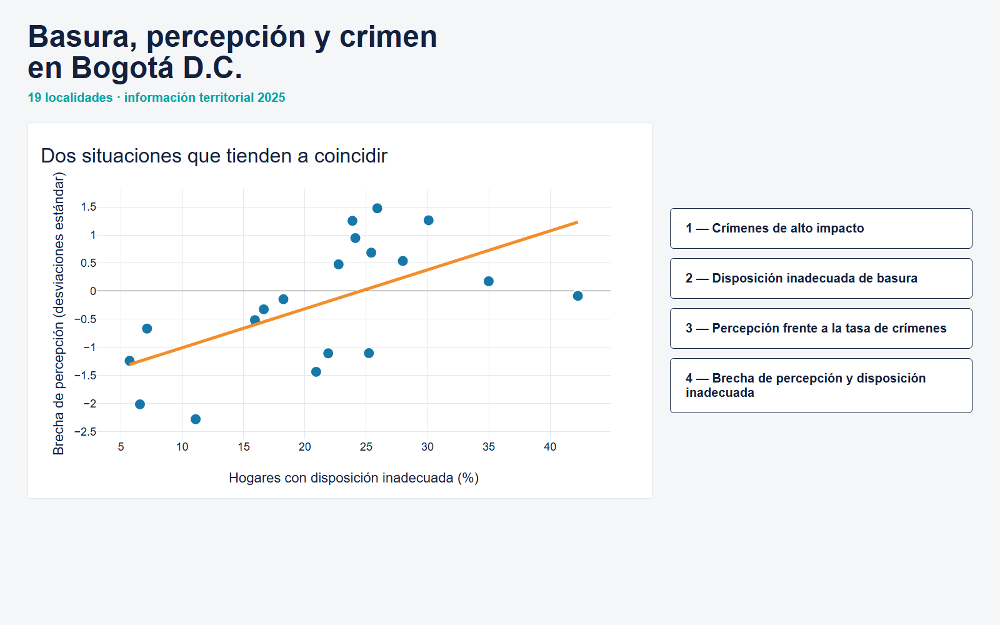

# Basura, percepción y crimen en Bogotá D.C.

Dashboard territorial interactivo para explorar la disposición inadecuada de basura, los delitos de alto impacto y la percepción de inseguridad en 19 localidades de Bogotá D.C. durante 2025.

El producto principal es un único archivo HTML construido con Plotly, sin Dash ni servidor:

**[Abrir dashboard interactivo](outputs/dashboard_bogota.html)**



## Descripción del problema abordado

El proyecto busca responder la siguiente pregunta:

> **¿Existe una relación entre la proporción de hogares con disposición inadecuada de basura y la brecha de percepción de inseguridad en las localidades de Bogotá D.C.?**

La inseguridad que percibe la ciudadanía no necesariamente coincide con el número de delitos registrados. Además, los conteos administrativos no incluyen los hechos que no fueron denunciados y los valores absolutos están influidos por el tamaño de la población de cada localidad.

Por esta razón, la herramienta integra información ambiental, delictiva, demográfica y de percepción. El dashboard permite examinar por separado cada componente y posteriormente analizar su relación territorial. Los resultados describen asociaciones y no demuestran causalidad.

## Principales funcionalidades

La pantalla inicial permite acceder a cuatro paneles:

1. **Crímenes de alto impacto:** mapas de delitos registrados, tasa oficial por cada 100.000 habitantes y tasa estimada al incorporar la no denuncia. La selección de una localidad actualiza el desglose por tipo de delito y muestra sus valores territoriales.
2. **Disposición inadecuada de basura:** comparación del porcentaje de hogares por localidad mediante barras seleccionables.
3. **Percepción frente a la tasa de crímenes:** respuestas de denuncia, percepción de inseguridad nocturna y construcción territorial del índice de brecha perceptual.
4. **Brecha de percepción y disposición inadecuada:** diagrama de dispersión, tendencia general y mapa del aporte de cada localidad a la asociación observada.

Todas las gráficas permiten consultar valores mediante hover. Los mapas y las barras incorporan selecciones enlazadas mediante JavaScript embebido en el mismo HTML.

## Fuentes de datos utilizadas

| Fuente local | Contenido utilizado |
|---|---|
| `data/raw/botaderos_inadecuados.csv` | Hogares que reportan disposición inadecuada de basura por localidad. |
| `data/raw/delitos_alto_impacto.geojson` | Conteos de delitos de alto impacto registrados durante 2025 y su desglose por tipo. |
| `data/raw/encuesta_distrital_percepcion_2025.xlsx` | Personas y hogares que reportaron denunciar, porcentaje de denuncia y percepción de inseguridad al caminar de noche. |
| `data/raw/proyecciones_poblacion_localidad_2005_2035.ods` | Población proyectada para 2025, utilizada para calcular tasas por cada 100.000 habitantes. |
| `data/raw/dai_shp/DAILoc.shp` | Límites geográficos de las localidades de Bogotá. |

Los archivos procesados reutilizados son:

- `data/processed/botaderos_inadecuados-procesado.csv`;
- `data/processed/indice_localidad_disposicion_inadecuada.csv`;
- `data/processed/dashboard_dataset.csv`.

El notebook final genera dos tablas auxiliares necesarias para las interacciones que no estaban disponibles en el dataset analítico principal:

- `data/processed/dashboard_crime_detail.csv`;
- `data/processed/dashboard_reporting_summary.csv`.

La trazabilidad metodológica de las fuentes también se documenta en [`docs/Nota técnica sobre integración de datos públicos.pdf`](docs/Nota%20técnica%20sobre%20integración%20de%20datos%20públicos.pdf).

## Metodología general

1. **Integración territorial:** se normalizan los nombres de las localidades y se conserva una fila por localidad en el dataset analítico común.
2. **Crímenes registrados:** se suman ocho categorías de delitos de alto impacto disponibles para 2025.
3. **Ajuste por no denuncia:** cada tipo de delito se ajusta con la proporción de hogares que afirmó haber denunciado. La metodología existente limita estas proporciones entre 10 % y 95 % para evitar estimaciones inestables por celdas pequeñas.
4. **Tasas comparables:** los delitos registrados y estimados se relacionan con la población proyectada y se expresan por cada 100.000 habitantes.
5. **Percepción nocturna:** se suman las respuestas «Inseguro/a» y «Muy inseguro» a la pregunta sobre caminar solo por el barrio de noche.
6. **Estandarización:** la percepción de inseguridad y el logaritmo de la tasa estimada de delitos se convierten en puntuaciones z. Una unidad representa una desviación estándar respecto al promedio de las localidades.
7. **Brecha perceptual:** se calcula como `inseguridad estandarizada − tasa de delitos estandarizada`. Un valor positivo indica que la percepción de inseguridad se encuentra por encima de lo sugerido por la tasa estimada relativa.
8. **Análisis de asociación:** se calculan las correlaciones de Pearson y Spearman entre la disposición inadecuada y la brecha perceptual, junto con una tendencia lineal. No se realizan afirmaciones causales.

En las 19 localidades analizadas se obtuvo una asociación positiva moderada: Pearson `0,59` y Spearman `0,71`.

## Instrucciones de despliegue

### Uso local

No es necesario iniciar un servidor. Basta con descargar o clonar el repositorio y abrir el siguiente archivo en Chrome, Edge o Firefox:

```text
outputs/dashboard_bogota.html
```

El archivo contiene Plotly y todos los datos necesarios. Funciona sin conexión a internet, Python o Jupyter.

### Publicación web

El dashboard puede publicarse en cualquier servicio de archivos estáticos, por ejemplo GitHub Pages, Netlify o un servidor institucional. Se debe conservar completo el archivo `outputs/dashboard_bogota.html`; no necesita API, base de datos ni proceso en segundo plano.

Si se utiliza GitHub Pages, puede publicarse el repositorio desde una rama habilitada y enlazar directamente:

```text
/outputs/dashboard_bogota.html
```

## Instrucciones de ejecución

### 1. Preparar el entorno

```bash
git clone https://github.com/cesarspc/datajam-udata.git
cd datajam-udata

python -m venv .venv
source .venv/bin/activate       # Linux o macOS
# .venv\Scripts\activate        # Windows

python -m pip install -r requirements.txt
```

### 2. Reconstruir el dashboard

Si `data/processed/dashboard_dataset.csv` ya existe, solo es necesario ejecutar:

```text
notebooks/07_dashboard_integrado_exportacion.ipynb
```

Desde Jupyter:

```bash
jupyter lab
```

Abrir el notebook `07`, reiniciar el kernel y ejecutar todas las celdas. Esta ejecución reconstruye:

```text
outputs/dashboard_bogota.html
data/processed/dashboard_crime_detail.csv
data/processed/dashboard_reporting_summary.csv
```

También puede ejecutarse y verificarse desde la terminal:

```bash
python scripts/execute_dashboard_notebooks.py \
  notebooks/07_dashboard_integrado_exportacion.ipynb
```

### 3. Regenerar el dataset analítico

Si `dashboard_dataset.csv` no existe o cambiaron los datos procesados de origen, ejecutar primero:

```text
notebooks/00_preparacion_y_validacion.ipynb
```

Después, ejecutar nuevamente el notebook `07`. Los notebooks `01` a `06` son análisis y validaciones independientes; no son dependencias de ejecución del dashboard final.

## Estructura del repositorio

```text
datajam-udata/
├── data/
│   ├── raw/                         # Fuentes originales y geometrías
│   │   └── dai_shp/                 # Límites de localidades
│   └── processed/                   # Dataset analítico y tablas auxiliares
├── docs/                            # Documentación metodológica
├── notebooks/
│   ├── procesar_botaderos_basura.ipynb
│   ├── reconstruccion_disposicion_inadecuada.ipynb
│   ├── 00_preparacion_y_validacion.ipynb
│   ├── 01_kpis.ipynb
│   ├── 02_relacion_scatter.ipynb
│   ├── 03_heatmap_correlaciones.ipynb
│   ├── 04_mapas_territoriales.ipynb
│   ├── 05_ranking_localidades.ipynb
│   ├── 06_hallazgos.ipynb
│   └── 07_dashboard_integrado_exportacion.ipynb
├── outputs/
│   ├── dashboard_bogota.html        # Producto interactivo final
│   └── capturas/                    # Imágenes para documentación
├── rules/                           # Especificaciones del proyecto
├── scripts/
│   ├── build_dashboard_notebooks.py
│   └── execute_dashboard_notebooks.py
├── src/
│   ├── dashboard_utils.py           # Carga, validación y componentes comunes
│   └── multipanel_dashboard.py      # Paneles, navegación y eventos interactivos
├── README.md
└── requirements.txt
```

## Reproducibilidad y alcance

- Los cálculos se obtienen de los datos incluidos en el repositorio; las estadísticas no están codificadas manualmente.
- Las rutas se resuelven respecto a la raíz del proyecto mediante `pathlib`.
- El producto cubre las 19 localidades con información completa en todas las fuentes utilizadas.
- El análisis es ecológico y exploratorio a escala de localidad. Sus resultados no deben trasladarse automáticamente a hogares, personas o barrios ni interpretarse como evidencia causal.
